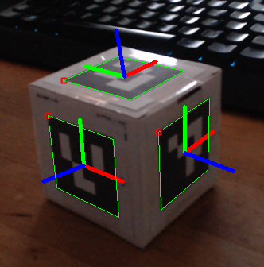
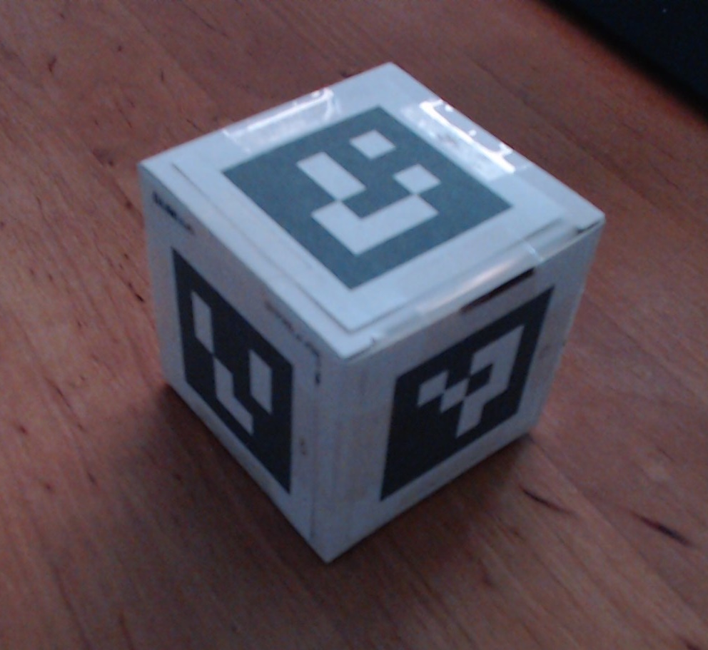
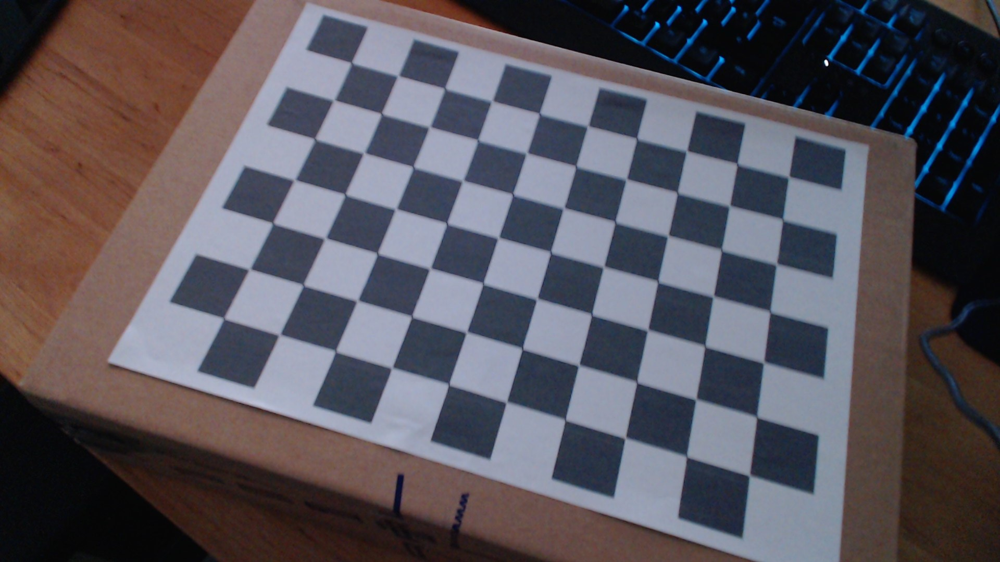

# Cube Tracker

A python tool that uses six ArUco markers in order to track a cube in a 3D space using a webcam and OpenCV.



## Building the Cube

The cube must be at least 50x50x50mm big for the 50x50mm ArUco markers to fit.

1) Print out `data/aruco_markers_4x4_50` on A4 without scaling
2) Cut out the markers to still have a white border (see image below)
   
3) Stick the images to the sides of the cube in the cube's surface pattern shown below (also mind the orientation)
   ```
     |4|
   |3|0|1|2|
     |5|
   ```

## Calibrating the Camera

1) Install the requirements:
   ```shell
   pip install -r reqirements.txt
   ```
2) Print out `data/calibration_checkerboard` on A4 without scaling
3) Get a solid plate (like a cardboard box) and stick the checkerboard onto it, so it cannot bend anymore
   
4) Use your webcam to make 20 images of your checkerboard
    - Use the Windows Camera app or something similar
    - Tilt the board in different directions and change the distance to the camera inbetween the images
5) Move the images into the `calibration_images` folder
6) Run the calibration script:
   ```shell
   python calibrate_camera.py
   ```
7) Your calibration results are saved in `camera.yml`

## Using the Project

1) Install the requirements if not already done:
   ```shell
   pip install -r requirements.txt
   ```
2) After calibrating, start the main script:
   ```shell
   python cube_tracker.py
   ```
3) Press `q` to quit
